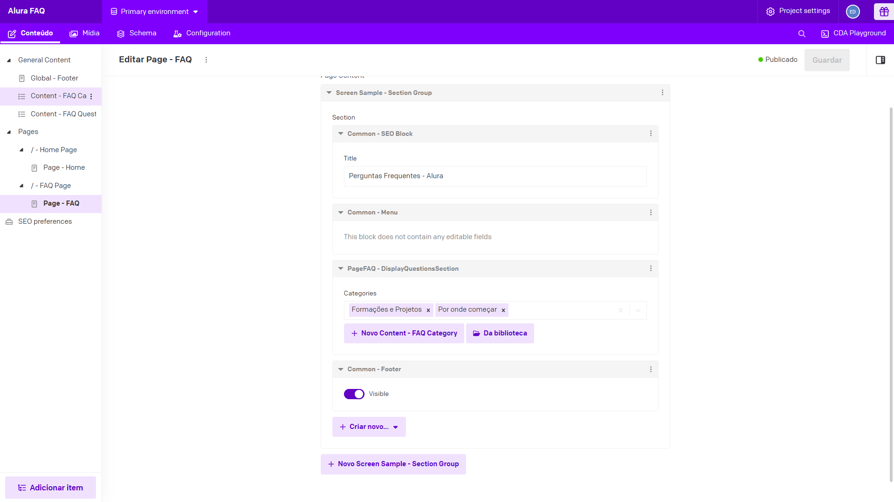
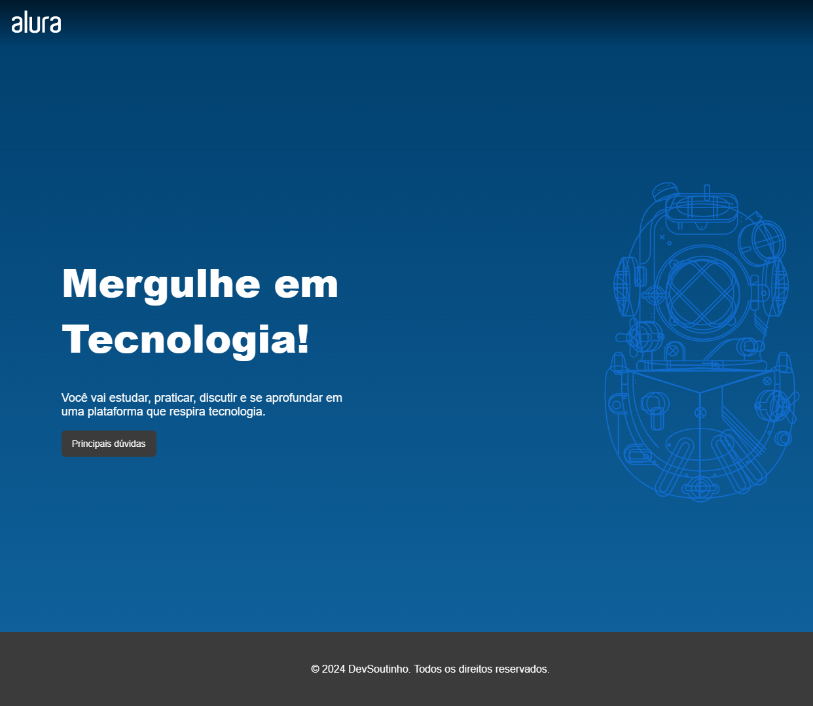
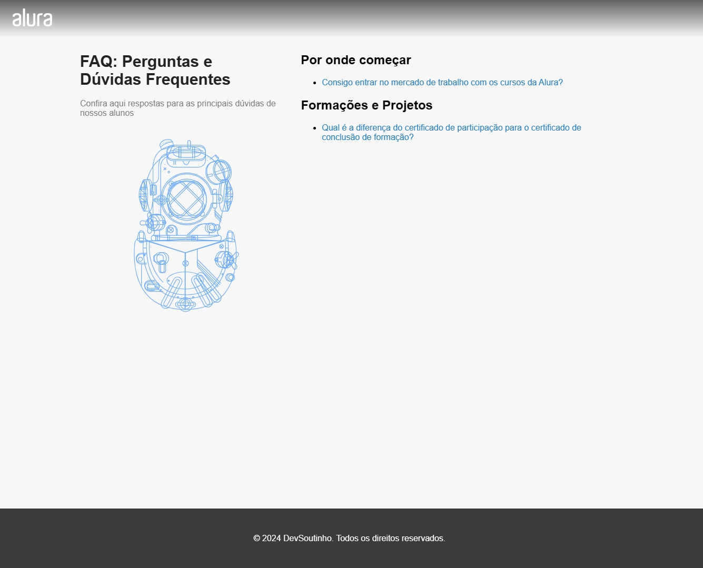
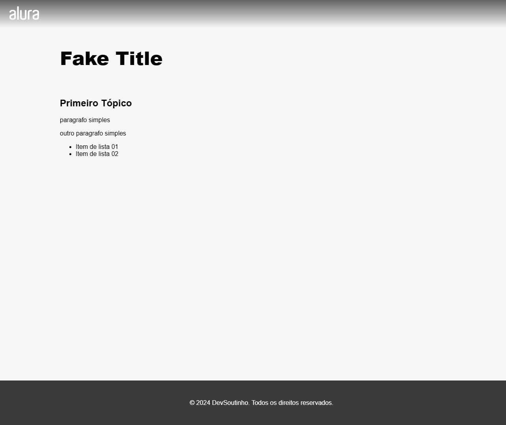

<p align="center">
  
  <hr>
  <h1 align="center">Alura FAQ</h1>
  <p align="center">Projeto desenvolvido durante o curso: <strong>Next.js: Trabalhando com um CMS</strong>.</p>
</p>

<p align="center">
  
  <a aria-label="Last Commit" href="https://github.com/felipe-dr/alurafaq-web-next/commits/main">
    
  </a>
  
  
</p>

<p align="center">
  <a target="_blank" href="https://nextjs.org/">
    
  </a>
  <a target="_blank" href="https://reactjs.org/">
    
  </a>
  <a target="_blank" href="https://styled-components.com/">
    
  </a>
  <a target="_blank" href="https://www.datocms.com/">
    
  </a>
</p>

## Índice

<ol>
  <li><a href="#📑-sobre">Sobre</a></li>
  <li><a href="#⚙️-funcionalidades">Funcionalidades</a></li>
  <li><a href="#🚀-como-executar">Como executar</a></li>
  <li><a href="#🛠️-tecnologias">Tecnologias</a></li>
  <li><a href="#🦸-autor">Autor</a></li>
  <li><a href="#📝-licença">Licença</a></li>
</ol>

## 📑 Sobre

O Alura FAQ é um projeto que inicialmente continha apenas conteúdos estáticos (dados fixos no código) e que foi integrado com o DatoCMS, afim de serem gerenciados e personalizados por meio de uma interface administrativa.

## ⚙️ Funcionalidades

- [x] Usuário administrador da plataforma CMS, poderá customizar informações globais e específicas de cada página, tais como:

  - [x] Hero da página inicial
    - Título
    - Descrição
    - Botão de CTA
  - [x] Página FAQ
    - Título
    - Descrição
    - Criar novos itens de FAQ
    - Criar conteúdo interno de cada item de FAQ
  - [x] Footer
    - Texto de direitos

  

- [x] Visitante poderá acessar a página de FAQ e encontrar as principais perguntas e respostas de um determinado assunto que foi cadastrado na plataforma de CMS, visualizando o conteúdo interno de cada item.

  

  

  

## 🚀 Como executar

### Pré-requisitos

É necessário que se tenha um projeto criado no [DatoCMS](https://www.datocms.com/) com o seu respectivo `token`, para ser possível integrá-lo ao projeto, assim como os `schemas` de entradas já pré-definidos para o consumo no projeto.

> [!IMPORTANT] Importante
> No procedimento abaixo, é fornecido um `token` de um projeto criado no DatoCMS, assim como os `schemas` e dados já cadastrados.

#### Executar o projeto localmente

1. Clone o repositório

```bash
git clone git@github.com:felipe-dr/alurafaq-web-next.git
```

2. Acesse a pasta do projeto no seu terminal / cmd

```bash
cd alurafaq-web-next
```

3. Instale as dependências

- Utilizando `pnpm`

```bash
pnpm install
```

- Utilizando `npm`

```bash
npm install
```

- Utilizando `yarn`

```bash
yarn install
```

4. DatoCMS

- Navegue até o arquivo `.env.example` na raíz do projeto
- Copie a chave e o valor `DATO_TOKEN`
- Crie um arquivo chamado `.env` na pasta raíz do projeto e cole a chave copiada anteriormente

5. Execute a aplicação em modo de desenvolvimento

- Utilizando `pnpm`

```bash
pnpm dev
```

- Utilizando `npm`

```bash
npm run dev
```

- Utilizando `yarn`

```bash
yarn dev
```

6. A aplicação estará disponível na porta: `3000`

```bash
http://localhost:3000
```

## 🛠️ Tecnologias

- [Next.js](https://nextjs.org/)
- [React.js](https://reactjs.org/)
- [Styled components](https://styled-components.com/)
- [DatoCMS](https://www.datocms.com/)

> Veja o arquivo [package.json](./package.json) na íntegra.

## 🦸 Autor

<a href="https://github.com/felipe-dr">
  
  <br />
  <sub><strong>Felipe DR</strong></sub>
</a>

Analista desenvolvedor

[](mailto:felipe.corp7@gmail.com)

## 📝 Licença

Este projeto está sob a licença [MIT](./LICENSE).
